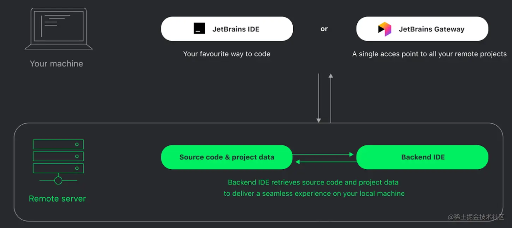
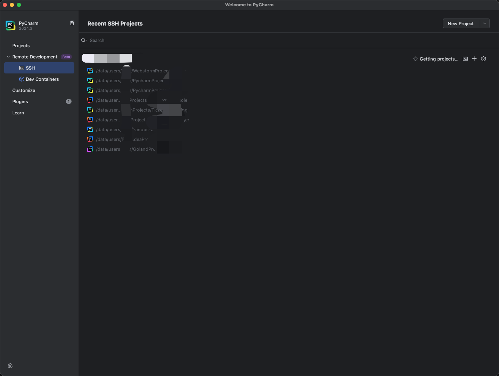
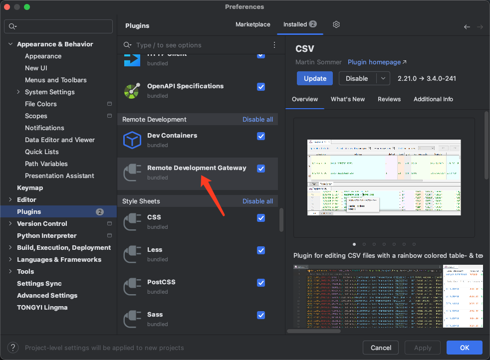
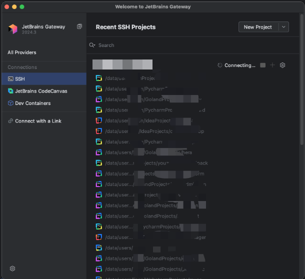
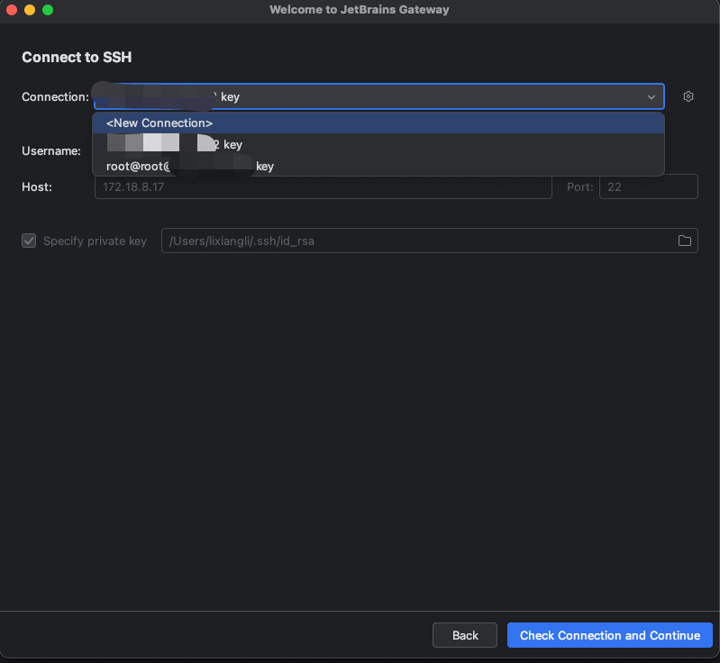
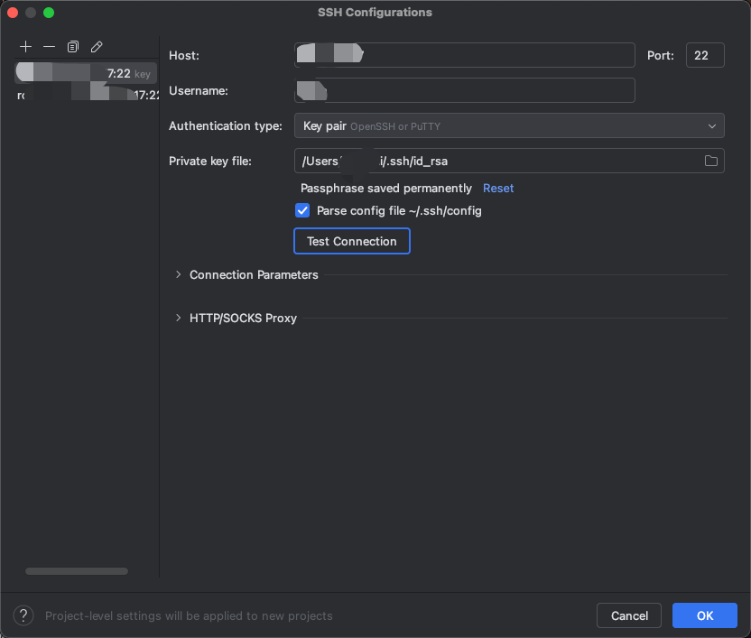
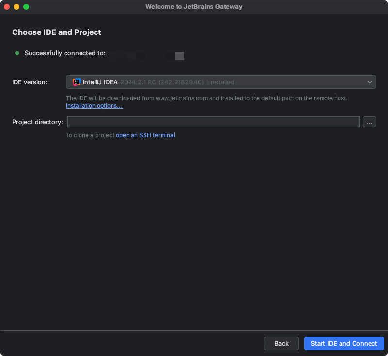
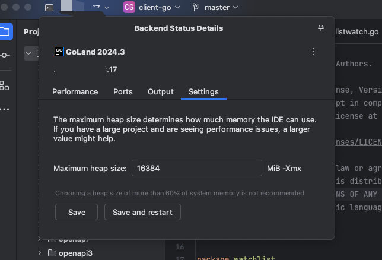

### 简单原理

Gateway 会在本地安装一个轻量的客户端，以及在 server 端安装远程后台 IDE。
- 本地客户端负责提供 UI 界面，它的操作跟基于 Intellij 的完整IDE一样，有同样的编辑器，能进行代码补全、导航、检查、重构等操作，就像本地 IDE 一样，但所有的这些代码都是保存在 server 端的，实际操作也是运行在 server 端的。
- 远程后台 IDE，负责托管远端的代码，所有处理都会在 server 端完成，例如执行脚本、调试。

### 准备工作
1. 需要先购买/激活 JetBrains 的软件，任意一个Idea或者JetBrains Gateway
2. 需要一台高性能 server，支持 ssh 远程登录
#### JetBrains软件
   [如何高性价比激活JetBrains全家桶](http://e.tb.cn/h.T1NT5hBEX3Mvjuh?tk=E4BL3HiWp8a)
1. idea版本需要大于2022.1 ，有SSH选项且相对比较稳定（建议直接使用2024.1以上，亲测好用），开启Remote Development Gateway插件（一般默认开启）
   

   

2. 远程开发专用客户端[JetBrains Gateway](https://www.jetbrains.com/remote-development/gateway/)
   

#### 高性能支持ssh远程登录的服务器
有一台可以使用服务器提前加账号，把自己公钥放进去

### 开始远程开发

新建一个连接，一开始没配置过远程ssh配置，需要下图右边进去配置

ssh 配置，填ip地址用户名，选择私钥文件地址，最后测试下连接

连接成功之后要选择IDEA类型和版本

版本怎么选：
- EAP：（Early Access Program）版本则更接近于Beta阶段，但可能还包含一些Beta阶段不会有的新功能或改进（每隔30天会自动重新下载，着急打开代码的时候很急）
- Beta：公测版本
- RC：指可能成为最终产品的候选版本，如果未出现问题则可发布成为正式版本

到服务器上clone你的代码然后选择对应的路径，"Download IDE and Connect"

一些心得

1. 调整下堆大小
   

2. Port forward
   

3. 插件装到host还是client，安装新版本client之后插件需要重新安装
4. 免费的copilot，阿里通义灵码
5. JetBrains Toolbox 自动更新，清理缓存