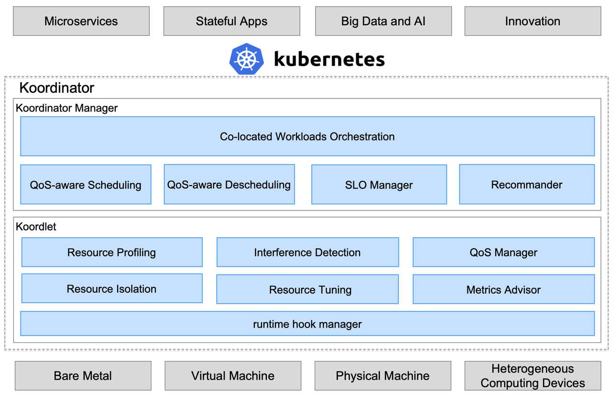
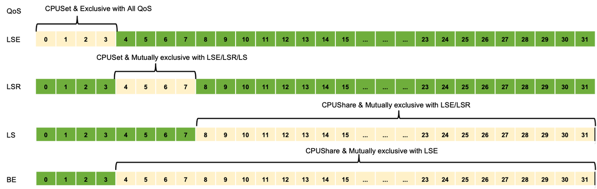
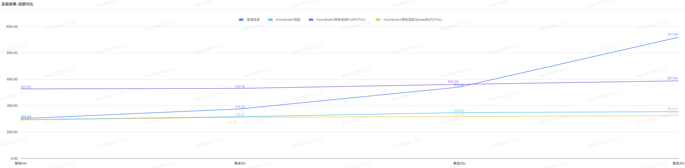

## 简介

官网： https://koordinator.sh/

koordinator 是一个基于 qos 的 kubernetes 混合工作负载调度系统。它旨在提高对延迟敏感的工作负载和批处理作业的运行时效率和可靠性，简化与资源相关的配置调整的复杂性，并增加 pod 部署密度以提高资源利用率。

**文章基于**

Koordinator版本： 1.0.0

内核版本： Anolis-4.19.91-26.6

<!--more-->

### 两种关键机制

* QoS


| QoS                              | 特点                                                            | 说明                                                                                                                           |
| ---------------------------------- | ----------------------------------------------------------------- | -------------------------------------------------------------------------------------------------------------------------------- |
| SYSTEM                           | 系统进程，资源受限                                              | 对于 DaemonSets 等系统服务，虽然需要保证系统服务的延迟，但也需要限制节点上这些系统服务容器的资源使用，以确保其不占用过多的资源 |
| LSE(Latency Sensitive Exclusive) | 保留资源并组织同 QoS 的 pod 共享资源                            | 很少使用，常见于中间件类应用，一般在独立的资源池中使用 （不超卖）                                                              |
| LSR(Latency Sensitive Reserved)  | 预留资源以获得更好的确定性                                      | 类似于社区的 Guaranteed，CPU 核被绑定 （不超卖）                                                                               |
| LS(Latency Sensitive)            | 共享资源，对突发流量有更好的弹性                                | 微服务工作负载的典型QoS级别，实现更好的资源弹性和更灵活的资源调整能力                                                          |
| BE(Best Effort)                  | 共享不包括 LSE 的资源，资源运行质量有限，甚至在极端情况下被杀死 | 批量作业的典型 QoS 水平，在一定时期内稳定的计算吞吐量，低成本资源                                                              |

* 优先级


| PriorityClass | 优先级范围   | 描述                                                     |
| --------------- | -------------- | ---------------------------------------------------------- |
| koord-prod    | [9000, 9999] | 需要提前规划资源配额，并且保证在配额内成功。             |
| koord-mid     | [7000, 7099] | 需要提前规划资源配额，并且保证在配额内成功。             |
| koord-batch   | [5000, 5999] | 需要提前规划资源配额，一般允许借用配额。                 |
| koord-free    | [3000, 3999] | 不保证资源配额，可分配的资源总量取决于集群的总闲置资源。 |

### 架构图



### 调度能力

#### 内核调度能力

https://help.aliyun.com/document_detail/155424.html

#### 单节点调度能力

##### CPU 抑制

此特性适用于BE QoS的pod， 意思是只针对BE QoS的pod压缩CPU。


| **Koordinator的参数名**     | **参数说明**                                                                                                                                                                                                                                                                                                                                                                                                                                            | 对应的cgroup参数名                 | 适用的QoS | **影响范围**                  |
| ----------------------------- | --------------------------------------------------------------------------------------------------------------------------------------------------------------------------------------------------------------------------------------------------------------------------------------------------------------------------------------------------------------------------------------------------------------------------------------------------------- | ------------------------------------ | ----------- | ------------------------------- |
| cpuSuppressPolicy           | 支持cpuset和cpuQuota两种策略。cpuset策略对最终调整的是cgroup中的cpuset.cpus，cpuQuota测试最终调整的是cgroup中的cpu.cfs_quota_us。<br/>( **这里可忽略：** *当kubelet中cpu-manager-policy设置为static时，对于cpuset策略生效的是新计算的cpuset不和老的cpuset进行merge；* *当kubelet中的cpu-manager-policy不设置时， 对于cpuset策略生效的是新计算的cpuset和老的cpuset进行merge， 且为了避免cgroup上下级冲突，会做2次apply。* )<br/>**默认策略为：cpuset。** | cpuset.cpus和cpu.cfs_quota_us<br/> | BE<br/>   | Pod和Pod.Spec.Containers<br/> |
| cpuSuppressThresholdPercent | 用于计算BE的pods可以使用的cpu：*suppress(BE) := node.Status.Allocatable.Cpu()* cpuSuppressThresholdPercent - pod(LS).Used - system.Used*<br/>最终可用的cpu是与策略有关联： (这里可以理解为需要修正下上一步计算出来的值，让其尽量合理一点)* 当策略为cpuset时， 上一步计算出来的值还需要与LSR占用的cpu再做计算；* 当策略为cpuQuota时， 上一步计算出来的值还需要与node.Status.Capacity.Cpu()的上浮再做计算。<br/>**默认值为： 65。**                       | -<br/>                             |           |                               |

##### CPU Burst

此特性只适用于LS QoS的pod， 不适用于其他LSR、BE等QoS的pod。

**CPU Burst和 CPU CFSQuota Burst策略在Koordinator中默认是不开启的。**


| **Koordinator的参数名**                     | **参数说明**                                                                                                                                                                                                                                                                                                                                                                                                                                                                                                                                | 对应的cgroup参数名 | 适用的QoS | **影响范围**             |
| --------------------------------------------- | --------------------------------------------------------------------------------------------------------------------------------------------------------------------------------------------------------------------------------------------------------------------------------------------------------------------------------------------------------------------------------------------------------------------------------------------------------------------------------------------------------------------------------------------- | -------------------- | ----------- | -------------------------- |
| cpuBurstStrategy.cpuBurstPercent<br/>       | 对应的计算公式为： cpu.cfs_burst_us = container.limit * burstCfg.CPUBurstPercent / 100 * cfs_period_us。 即：cpu最多可以使用到几倍的cpu limits。**注： 突发时最多可以使用多少cpu与平时空余的CPU资源有关， 具体可以看下面的参考文档。**<br/>启用策略参数为： auto或cpuBurstOnly<br/>参考文档：https://help.aliyun.com/document_detail/306980.html                                                                                                                                                                                            | cpu.cfs_burst_us   | LS        | Pod和Pod.Spec.Containers |
| cpuBurstStrategy.policy                     | 支持的策略类型： none、cpuBurstOnly、cfsQuotaBurstOnly、auto<br/>默认值： none                                                                                                                                                                                                                                                                                                                                                                                                                                                              | -                  |           |                          |
| cpuBurstStrategy.sharePoolThresholdPercent  | 当LS QoS的pod的实际cpu使用率大于此参数时， 则认为Node目前处于overload状态； 如果是overload状态， 则会影响下面pod在burst时使用的cfs_quota_us值， 即当node处于高负载时， 需要降低cpu burst的使用， 每次以0.8的倍数降低cfs_quota_us的值；当LS QoS的pod的实际cpu使用率小于0.9 * 此参数值是， 则认为Node处于idle状态； 如果是idle状态，且允许cpu burst的使用，每次以1.2的倍数提升cfs_quota_us的值；node的负载还有其他2种： cooling和unknown， cooling位于overload和idele之间；unknown是状态未知， 比如metrics指标没有采集上来等。<br/>默认值：50 | -<br/>             |           |                          |
| cpuBurstStrategy.cfsQuotaBurstPercent       | 对应的计算公式为： cpu.cfs_quota_us = container.limit * cfsQuotaBurstPercent / 100。<br/>burst限制器的容量为： cfsQuotaBurstPeriodSeconds * (cfsQuotaBurstPercent - 100)。 实际上计算方式同cfs_burst_us的方式， 都是过去一段时间空余的CPU资源有关。<br/>启用策略参数为： auto或cfsQuotaBurstOnly<br/>默认值：300                                                                                                                                                                                                                            | cpu.cfs_quota_us   |           |                          |
| cpuBurstStrategy.cfsQuotaBurstPeriodSeconds | 指定pod在burst时可以使用的最长的时间。<br/>默认：-1 (无限制)                                                                                                                                                                                                                                                                                                                                                                                                                                                                                |                    |           |                          |

##### Memory CGroup特性


| **Koordinator的参数名**     | **参数说明**                                                                                                                                                                                                                                                                                                                                                                                                                                                                                                                                                                                                                                                                                                                                                | 对应的cgroup参数名        | 适用的QoS               | **影响范围**                  |
| ----------------------------- | ------------------------------------------------------------------------------------------------------------------------------------------------------------------------------------------------------------------------------------------------------------------------------------------------------------------------------------------------------------------------------------------------------------------------------------------------------------------------------------------------------------------------------------------------------------------------------------------------------------------------------------------------------------------------------------------------------------------------------------------------------------- | --------------------------- | ------------------------- | ------------------------------- |
| memoryQOS.wmarkRatio<br/>   | 该接口用于设置是否启用memcg后台异步回收功能，以及设置异步回收功能开始工作的memcg内存水位线。单位是相对于memcg limit的百分之几。取值范围：0~100* 默认值为0，该值也表示禁用memcg后台异步回收功能。* 取值为非0时，表示开启memcg后台异步回收功能并设置对应的水位线。**推荐值: 95**<br/>memory.wmark_high = memory.limit_in_bytes * memory.wmark_ratio / 100)**当memcg内存使用超过该接口的值时，后台异步回收功能启动**<br/>参考文档：https://help.aliyun.com/document_detail/169535.html                                                                                                                                                                                                                                                                         | memory.wmark_ratio<br/>   | LSR/LS/BE               | Pod和Pod.Spec.Containers<br/> |
| memoryQOS.wmarkScalePermill | 该接口用于控制memory.wmark_high和memory.wmark_low之间的间隔。单位是相对于memcg limit的万分之几。取值范围：1~1000* 该接口在创建时，会继承父组的值（该值为50），该值也是默认值，即memcg limit的千分之五。* memcg根组目录不存在该接口文件。**推荐值: 20**<br/>memory.wmark_low = memory.wmark_high - memory.limit_in_bytes * memory.wmark_scale_factor / 10000**当memcg内存使用低于该接口的值时，后台异步回收结束**<br/>参考文档：https://help.aliyun.com/document_detail/169535.html                                                                                                                                                                                                                                                                          | memory.wmark_scale_factor |                         |                               |
| memoryQOS.wmarkMinAdj       | 表示基于全局最低水位线（global wmark_min）所作出的调整（adjustment）百分比。取值范围：-25 ~ 50，取值范围说明如下：* 该接口创建时，继承父组的值（值为0），即默认值为0。* 负值也表示global wmark_min下移，即提高时延敏感型业务的内存子系统服务质量（memcg QoS）* 负值也表示global wmark_min下移，即提高时延敏感型业务的内存子系统服务质量（memcg QoS）* 当偏移后的global wmark_min被触发后，会执行抑制操作，抑制操作的时间和超出的内存使用为线性比例关系。抑制时间的取值范围：1ms ~ 1000ms。<br/>**负值也表示global wmark_min下移，即提高时延敏感型业务的内存子系统服务质量（memcg QoS）；****负值也表示global wmark_min下移，即提高时延敏感型业务的内存子系统服务质量（memcg QoS）**<br/>参考文档： https://help.aliyun.com/document_detail/169537.html<br/> | memory.wmark_min_adj      |                         |                               |
| memoryQOS.priorityEnable    | 该接口用于设置是否启用memcg OOM优先级策略功能，取值为0或者1。该接口不会继承，默认值为0。* 取值为0时，表示禁用memcg OOM优先级策略功能。* 取值为1时，表示开启memcgOOM优先级策略功能。<br/>参考文档： https://help.aliyun.com/document_detail/435534.html                                                                                                                                                                                                                                                                                                                                                                                                                                                                                                      | memory.use_priority_oom   |                         |                               |
| memoryQOS.priority          | 该接口提供13个级别的memcg优先级以支持不同重要程度的业务。取值范围为0~12，数值越大表示优先级越高。该接口不会继承，默认值为0。***实现一定程度的内存QoS，此处需要说明的优先级值非全局变量，只能在同父cgroup下的兄弟节点进行比较。*** 对于优先级相等的兄弟节点来说，会按照组的内存使用量来排序选择内存使用最大的进行OOM操作。<br/>参考文档： https://help.aliyun.com/document_detail/435534.html                                                                                                                                                                                                                                                                                                                                                                | memory.priority           |                         |                               |
| memoryQOS.oomKillGroup      | <TODO: 还没找到说明文档>                                                                                                                                                                                                                                                                                                                                                                                                                                                                                                                                                                                                                                                                                                                                    | memory.oom.group          |                         |                               |
| memoryQOS.minLimitPercent   | 绝对锁定内存，即使系统没有可回收的内存，也不会回收该接口锁定的内存。<br/>memory.min = resources.Requests.Memory() * minLimitPercent / 100(BE的计算也是类似，取的requests值为： kubernetes.io/batch-memory)<br/>参考文档： https://help.aliyun.com/document_detail/169536.html                                                                                                                                                                                                                                                                                                                                                                                                                                                                               | memory.min                |                         |                               |
| memoryQOS.lowLimitPercent   | 相对锁定内存，如果系统没有其他可回收的内存，该接口锁定的内存也会被回收一部分。<br/>memory.min = resources.Requests.Memory() * lowLimitPercent / 100(BE的计算也是类似，取的requests值为： kubernetes.io/batch-memory)<br/>参考文档： https://help.aliyun.com/document_detail/169536.html                                                                                                                                                                                                                                                                                                                                                                                                                                                                     | memory.low<br/>           |                         |                               |
| memoryQOS.throttlingPercent | 限制memcg的内存使用。<br/>memory.high = resources.Limits.Memory() * throttlingPercent / 100(BE的计算也是类似，取的limits值为： kubernetes.io/batch-memory)<br/>参考文档： https://help.aliyun.com/document_detail/169536.html                                                                                                                                                                                                                                                                                                                                                                                                                                                                                                                               | memory.high               | Pod.Spec.Container<br/> |                               |

##### CPU&Memory Evict特性

此特性适用于BE QoS的pod， 意思是只对BE QoS的pod进行驱逐。


| **分类**                           | **Koordinator的参数名**                                                                                                                                                                                          | **参数说明**                     | 对应的cgroup参数名 | 适用的QoS | **影响范围** |
| ------------------------------------ | ------------------------------------------------------------------------------------------------------------------------------------------------------------------------------------------------------------------ | ---------------------------------- | -------------------- | ----------- | -------------- |
| **CPU Evict**                      | args.cpu-evict-cool-time-seconds                                                                                                                                                                                 | cpu驱逐的冷却周期， 默认是20s.   | -                  | BE        | Node         |
| cpuEvictTimeWindowSeconds          | 查询BE类Pod的cpu利用率的时间段。                                                                                                                                                                                 | -                                |                    |           |              |
| cpuEvictBESatisfactionLowerPercent | 计算公式为：BE类Pod的 CPURealLimit/CPURequest。根据上述公式计算出来的cpu百分比高于这个值， 则不发生pod的驱逐动作。<br/>合法值为：(0-60]                                                                          | -                                |                    |           |              |
| cpuEvictBESatisfactionUpperPercent | 计算公式为： cpuEvictBESatisfactionUpperPercent - 上个表格中计算出来的cpu比率。<br/>合法值为：(0-100]                                                                                                            | -<br/>                           |                    |           |              |
| **Memory Evict**                   | args.memory-evict-cool-time-seconds                                                                                                                                                                              | memory驱逐的冷却周期， 默认为4s. | -                  |           |              |
| memoryEvictThresholdPercent<br/>   | 内存驱逐阈值百分比。 计算是否超过这个阈值： A=MemoryUsed(不包含cache)/ node memoryCapacity，当超过这个阈值后， 需要释放的内存为： node memoryCapacity * (A - memoryEvictLowerPercent)  / 100<br/>默认值为： 70。 | -                                |                    |           |              |
| memoryEvictLowerPercent            | 内存占用(不包含cache)的安全线百分比。<br/>默认值为： memoryEvictThresholdPercent - 2 = 68。                                                                                                                      | -                                |                    |           |              |

##### 通用调度能力

此调度策略只适用于LSE、LSR并且priorityClass为koord-prod并且是Guaranted的pod(cpu和memory也必须是整数)。 Pod中的所有container也都需要是Guaranted的。



| **Koordinator的参数名**              | **参数说明**                                                                                                                                                                                                                                                                                                                                                                                                                        |  默认值 |
| -------------------------------------------- | ------------------------------------------------------------------------------------------------------------------------------------------------------------------------------------------------------------------------------------------------------------------------------------------------------------------------------------------------------------------------------------------------------------------------------------------- | --------------- |
| args.node-topology-sync-interval           | koordlet上报node topology的间隔。                                                                                                                                                                                                                                                                                                                                                                                                         | 3s            |
| scheduling.koordinator.sh/resource-spec    | 位于pod的annotations中，支持preferredCPUBindPolicy、preferredCPUExclusivePolicy策略。其中preferredCPUBindPolicy可以设置的值有：* Default (默认策略)* FullPCPUs，申请的cpu分配到同一个物理核上**SpreadByPCPUs* ，申请的cpu分配到不同物理核上，即打散到不同的核上**ConstrainedBurst* ，其中preferredCPUExclusivePolicy可以设置的值有：* None， 没有排他策略* PCPULevel， 同一个物理核互斥(pod间)* NUMANodeLevel，同一个NUMA Node互斥(pod间) | -             |
| scoringStrategy                            | 位于scheduler config中，可以设置的值有：* MostAllocated (默认)，打分逻辑为： (requestCPUs * 100) / freeCPUs**BalancedAllocation** LeastAllocated，打分逻辑为：(freeCPUs - requestCPUs) * 100 / freeCPUs最终的分数会在这个区间： [0, 32.23]                                                                                                                                                                                                | -             |
| node.koordinator.sh/cpu-bind-policy        | 位于node的labels中， 可以设置的值有：* FullPCPUsOnly， 需要pod申请的cpu核数%(一个物理核有多少个逻辑核)==0并且pod的bind策略需要为FullPCPUs。 当kubelet的cpu option策略为full-pcpus-only时，也需要满足前面的条件。                                                                                                                                                                                                                          | -             |
| node.koordinator.sh/numa-allocate-strategy | 位于node的labels中，可以设置的值有：* MostAllocated(默认)，* LeastAllocated**DistributeEvenly*<br/>**注，也可以在scheduler config中设置打分类型(限MostAllocated和LeastAllocated)，node label上的优先级更高**                                                                                                                                                                                                                              | -             |

## 实验

### 实验描述

将在线业务和离线业务混部在同一台node上，通过在线业务90指标，来量化混部效果，比较普通混部、Koordinator混部和Koordinator混部绑核策略在单节点离线利用率逐步增加情况下的性能表现。

- 普通混部：混跑在线和离线，使用当前生产环境一样配置的节点
- Koordinator混部：混跑在线和离线，离线BE
- Koordinator混部绑核：混跑在线和离线，在线启用CPU绑核，离线BE

在线业务压测命令
`wrk -t16 -c50 -d180s --latency "http://10.215.113.57:8080/calculate"`

**以下所有实验内容均是社区默认配置，除cpu的绑核策略**

### 模拟应用

#### 在线业务

8c16g  go 1.17

```yaml
apiVersion: apps/v1
kind: Deployment
metadata:
  labels:
    app: online-service-mock
  name: online-service-mock
  namespace: qa
spec:
  progressDeadlineSeconds: 600
  replicas: 1
  revisionHistoryLimit: 10
  selector:
    matchLabels:
      app: online-service-mock
  strategy:
    rollingUpdate:
      maxSurge: 25%
      maxUnavailable: 25%
    type: RollingUpdate
  template:
    metadata:
      creationTimestamp: null
      labels:
        app: online-service-mock
      name: online-service-mock
    spec:
      containers:
      - image: leason001/online-mock:v1.0.0
        imagePullPolicy: IfNotPresent
        name: online-service
        resources:
          limits:
            cpu: "8"
            memory: 16000Mi
          requests:
            cpu: "8"
            memory: 16000Mi
        terminationMessagePath: /dev/termination-log
        terminationMessagePolicy: File
      dnsPolicy: ClusterFirst
      nodeSelector:
        koordinator: "false"
      restartPolicy: Always
      securityContext: {}
      terminationGracePeriodSeconds: 30
```

#### 离线业务

```yaml
apiVersion: apps/v1
kind: Deployment
metadata:
  name: offline-job
  labels:
    app: offline-job
spec:
  replicas: 2
  selector:
    matchLabels:
      app: offline-job
  template:
    metadata:
      name: offline-job
      labels:
        app: offline-job
        colocation-profile-job: "true"
        koordinator.sh/enable-colocation: "true"
    spec:
      schedulerName: koord-scheduler
      nodeSelector:
        koordinator: "true"
      containers:
      - name: offline-job
        image: harbor.qima-inc.com/lisen/bigdata-test7
        args:
        - --maxConcurrency=20
        - --maxFile=20
        resources:
          limits:
            cpu: 2000m
            memory: "4000Mi"
          requests:
            cpu: 500m
            memory: "500Mi"
```

### 环境

Koordinator版本： 1.0.0
kubernetes：v1.21.7
Node 节点 48c 可分配cpu 47c

#### 混部配置

##### Job（BE + koord-batch）

```YAML
apiVersion: config.koordinator.sh/v1alpha1
kind: ClusterColocationProfile
metadata:
  name: colocation-profile-job
spec:
  namespaceSelector:
    matchLabels:
      koordinator.sh/enable-colocation: "true"
  selector:
    matchLabels:
      koordinator.sh/enable-colocation: "true"
      colocation-profile-job: "true"
  qosClass: BE
  priorityClassName: koord-batch
  koordinatorPriority: 5000
  schedulerName: koord-scheduler
  labels:
    koordinator.sh/mutated: "true"
  annotations:
    koordinator.sh/intercepted: "true"
  patch:
    spec:
      terminationGracePeriodSeconds: 30
      schedulerName: koord-scheduler
```

##### L1Web （LSR + koord-prod）

```YAML
apiVersion: config.koordinator.sh/v1alpha1
kind: ClusterColocationProfile
metadata:
  name: colocation-profile-l1web
spec:
  namespaceSelector:
    matchLabels:
      koordinator.sh/enable-colocation: "true"
  selector:
    matchLabels:
      koordinator.sh/enable-colocation: "true"
      colocation-profile-l1web: "true"
  qosClass: LSR
  priorityClassName: koord-prod
  koordinatorPriority: 9100
  schedulerName: koord-scheduler
  labels:
    koordinator.sh/mutated: "true"
  annotations:
    koordinator.sh/intercepted: "true"
    scheduling.koordinator.sh/resource-spec: '{"preferredCPUBindPolicy": "SpreadByPCPUs"}'  # 根据node特性选择绑核策略 SpreadByPCPUs
  patch:
    spec:
      terminationGracePeriodSeconds: 30
      schedulerName: koord-scheduler
```

##### L2L3Web （LS + koord-mid）

```YAML
apiVersion: config.koordinator.sh/v1alpha1
kind: ClusterColocationProfile
metadata:
  name: colocation-profile-l2l3web
spec:
  namespaceSelector:
    matchLabels:
      koordinator.sh/enable-colocation: "true"
  selector:
    matchLabels:
      koordinator.sh/enable-colocation: "true"
      colocation-profile-l2l3web: "true"
  qosClass: LS
  priorityClassName: koord-mid
  koordinatorPriority: 7010
  schedulerName: koord-scheduler
  labels:
    koordinator.sh/mutated: "true"
  annotations:
    koordinator.sh/intercepted: "true"
  patch:
    spec:
      terminationGracePeriodSeconds: 30
      schedulerName: koord-scheduler
```

### 实验数据


| 混部类型/离线c                           | 30c                                                                                                                                                                                                                                                                                                                                                                                                                                                                                                                                                                                                                                                                                                                                                                                                                                                                                                                                                          | 20c                                                                                                                                                                                                                                                                                                                                                                                                                                                                                                                                                                                                                                                                                                         | 10c                                                                                                                                                                                                                                                                                                                                                                                                                                                                                                                                                                                                                                                                                                         | 4c                                                                                                                                                                                                                                                                                                                                                                                                                                                                                                                                                                                                                                                                                                               | 0c                                                                                                                                                                                                                                                                                                                                                                                                                                                          |
| ------------------------------------------ | -------------------------------------------------------------------------------------------------------------------------------------------------------------------------------------------------------------------------------------------------------------------------------------------------------------------------------------------------------------------------------------------------------------------------------------------------------------------------------------------------------------------------------------------------------------------------------------------------------------------------------------------------------------------------------------------------------------------------------------------------------------------------------------------------------------------------------------------------------------------------------------------------------------------------------------------------------------- | ------------------------------------------------------------------------------------------------------------------------------------------------------------------------------------------------------------------------------------------------------------------------------------------------------------------------------------------------------------------------------------------------------------------------------------------------------------------------------------------------------------------------------------------------------------------------------------------------------------------------------------------------------------------------------------------------------------- | ------------------------------------------------------------------------------------------------------------------------------------------------------------------------------------------------------------------------------------------------------------------------------------------------------------------------------------------------------------------------------------------------------------------------------------------------------------------------------------------------------------------------------------------------------------------------------------------------------------------------------------------------------------------------------------------------------------- | ------------------------------------------------------------------------------------------------------------------------------------------------------------------------------------------------------------------------------------------------------------------------------------------------------------------------------------------------------------------------------------------------------------------------------------------------------------------------------------------------------------------------------------------------------------------------------------------------------------------------------------------------------------------------------------------------------------------ | ------------------------------------------------------------------------------------------------------------------------------------------------------------------------------------------------------------------------------------------------------------------------------------------------------------------------------------------------------------------------------------------------------------------------------------------------------------- |
| 普通混部                                 | Running 3m test @ http://10.215.113.18:8080/calculate16 threads and 50 connectionsThread Stats   Avg      Stdev     Max   +/- StdevLatency   550.15ms  271.17ms   1.93s    69.42%Req/Sec     6.66      4.28    30.00     84.42%Latency Distribution50%  510.34ms75%  703.47ms90%  917.68ms99%    1.35s15862 requests in 3.00m, 2.07MB readSocket errors: connect 0, read 0, write 0, timeout 3Requests/sec:     88.08Transfer/sec:     11.78KB                                                                                                                                                                                                                                                                                                                                                                                                                                                                                                               | Running 3m test @ http://10.215.113.18:8080/calculate16 threads and 50 connectionsThread Stats   Avg      Stdev     Max   +/- StdevLatency   327.40ms  159.32ms   1.46s    70.45%Req/Sec    10.17      5.40    40.00     63.90%Latency Distribution50%  299.65ms75%  415.49ms90%  539.98ms99%  821.18ms26711 requests in 3.00m, 3.49MB readRequests/sec:    148.31Transfer/sec:     19.84KB                                                                                                                                                                                                                                                                                                                 | Running 3m test @ http://10.215.113.18:8080/calculate16 threads and 50 connectionsThread Stats   Avg      Stdev     Max   +/- StdevLatency   226.89ms  110.28ms   1.08s    70.81%Req/Sec    13.99      6.77    40.00     85.58%Latency Distribution50%  205.64ms75%  286.30ms90%  374.23ms99%  569.52ms38593 requests in 3.00m, 5.04MB readRequests/sec:    214.29Transfer/sec:     28.67KB                                                                                                                                                                                                                                                                                                                 | Running 3m test @ http://10.215.113.18:8080/calculate16 threads and 50 connectionsThread Stats   Avg      Stdev     Max   +/- StdevLatency   184.88ms   87.04ms 776.84ms   71.34%Req/Sec    16.82      7.66    50.00     64.93%Latency Distribution50%  167.91ms75%  230.62ms90%  300.64ms99%  458.58ms47324 requests in 3.00m, 6.18MB readRequests/sec:    262.76Transfer/sec:     35.15K                                                                                                                                                                                                                                                                                                                       | Running 3m test @ http://10.215.113.55:8080/calculate16 threads and 50 connectionsThread Stats   Avg      Stdev     Max   +/- StdevLatency   178.73ms   83.51ms 879.17ms   70.78%Req/Sec    17.31      7.72    50.00     64.96%Latency Distribution50%  162.46ms75%  222.69ms90%  291.30ms99%  438.10ms48909 requests in 3.00m, 6.39MB readRequests/sec:    271.58Transfer/sec:     36.33KB                                                                 |
| koordinator混部<br/>                     | Running 3m test @ http://10.215.113.162:8080/calculate16 threads and 50 connectionsThread Stats   Avg      Stdev     Max   +/- StdevLatency   214.49ms  119.05ms   1.99s    78.36%Req/Sec    14.74      7.13    50.00     84.39%Latency Distribution50%  191.36ms75%  267.01ms90%  353.57ms99%  564.37ms40763 requests in 3.00m, 5.33MB readSocket errors: connect 0, read 0, write 0, timeout 40Requests/sec:    226.39Transfer/sec:     30.29KB<br/>                                                                                                                                                                                                                                                       | Running 3m test @ http://10.215.113.162:8080/calculate16 threads and 50 connectionsThread Stats   Avg      Stdev     Max   +/- StdevLatency   208.99ms  113.97ms   1.77s    77.09%Req/Sec    15.14      7.25    50.00     84.29%Latency Distribution50%  186.23ms75%  260.93ms90%  346.60ms99%  566.10ms42035 requests in 3.00m, 5.49MB readSocket errors: connect 0, read 0, write 0, timeout 29Requests/sec:    233.44Transfer/sec:     31.23KB<br/>      | Running 3m test @ http://10.215.113.162:8080/calculate16 threads and 50 connectionsThread Stats   Avg      Stdev     Max   +/- StdevLatency   194.99ms  111.34ms   1.98s    82.42%Req/Sec    16.17      7.48    50.00     83.00%Latency Distribution50%  173.24ms75%  239.56ms90%  315.61ms99%  518.29ms45274 requests in 3.00m, 5.92MB readSocket errors: connect 0, read 0, write 0, timeout 25Requests/sec:    251.40Transfer/sec:     33.63KB<br/><br/> | Running 3m test @ http://10.215.113.162:8080/calculate16 threads and 50 connectionsThread Stats   Avg      Stdev     Max   +/- StdevLatency   180.80ms   94.63ms   2.00s    78.18%Req/Sec    17.21      7.80    50.00     63.62%Latency Distribution50%  162.15ms75%  223.27ms90%  293.00ms99%  461.81ms48506 requests in 3.00m, 6.34MB readSocket errors: connect 0, read 0, write 0, timeout 23Requests/sec:    269.31Transfer/sec:     36.03KB<br/><br/><br/> | Running 3m test @ http://10.215.113.18:8080/calculate16 threads and 50 connectionsThread Stats   Avg      Stdev     Max   +/- StdevLatency   177.73ms   97.08ms   1.92s    82.06%Req/Sec    17.55      7.78    50.00     64.91%Latency Distribution50%  159.45ms75%  216.63ms90%  283.87ms99%  459.59ms49562 requests in 3.00m, 6.48MB readSocket errors: connect 0, read 0, write 0, timeout 21Requests/sec:    275.21Transfer/sec:     36.82KB<br/>       |
| koordinato绑核混部（FullPCPUs）<br/>     | Running 3m test @ http://10.215.113.57:8080/calculate16 threads and 50 connectionsThread Stats   Avg      Stdev     Max   +/- StdevLatency   334.07ms  193.41ms   1.95s    70.73%Req/Sec    10.23      5.68    40.00     60.90%Latency Distribution50%  296.62ms75%  435.18ms90%  587.64ms99%  947.87ms26279 requests in 3.00m, 3.43MB readSocket errors: connect 0, read 0, write 0, timeout 44Requests/sec:    145.91Transfer/sec:     19.52KB<br/><br/><br/>                                                                                                                                                                                                                                              | Running 3m test @ http://10.215.113.57:8080/calculate16 threads and 50 connectionsThread Stats   Avg      Stdev     Max   +/- StdevLatency   324.44ms  180.21ms   1.94s    70.08%Req/Sec    10.45      5.76    40.00     61.67%Latency Distribution50%  290.98ms75%  420.13ms90%  560.88ms99%  886.12ms27007 requests in 3.00m, 3.53MB readSocket errors: connect 0, read 0, write 0, timeout 30Requests/sec:    149.95Transfer/sec:     20.06KB<br/><br/>  | Running 3m test @ http://10.215.113.57:8080/calculate16 threads and 50 connectionsThread Stats   Avg      Stdev     Max   +/- StdevLatency   304.60ms  168.88ms   1.87s    69.71%Req/Sec    11.06      5.97    40.00     59.44%Latency Distribution50%  272.04ms75%  395.56ms90%  530.16ms99%  825.95ms28942 requests in 3.00m, 3.78MB readSocket errors: connect 0, read 0, write 0, timeout 12Requests/sec:    160.71Transfer/sec:     21.50KB<br/>       | Running 3m test @ http://10.215.113.57:8080/calculate16 threads and 50 connectionsThread Stats   Avg      Stdev     Max   +/- StdevLatency   300.00ms  168.00ms   1.95s    69.55%Req/Sec    11.23      6.04    40.00     59.29%Latency Distribution50%  267.87ms75%  390.71ms90%  525.82ms99%  823.77ms29441 requests in 3.00m, 3.85MB readSocket errors: connect 0, read 0, write 0, timeout 6Requests/sec:    163.48Transfer/sec:     21.87KB<br/><br/><br/>   | Running 3m test @ http://10.215.113.158:8080/calculate16 threads and 50 connectionsThread Stats   Avg      Stdev     Max   +/- StdevLatency   297.46ms  168.29ms   2.00s    70.14%Req/Sec    11.31      6.12    40.00     59.13%Latency Distribution50%  265.11ms75%  386.61ms90%  520.25ms99%  818.87ms29682 requests in 3.00m, 3.88MB readSocket errors: connect 0, read 0, write 0, timeout 13Requests/sec:    164.84Transfer/sec:     22.05KB<br/><br/> |
| koordinato绑核混部（SpreadByPCPUs）<br/> | <br/>Running 3m test @ http://10.215.113.158:8080/calculate16 threads and 50 connectionsThread Stats   Avg      Stdev     Max   +/- StdevLatency   194.52ms  114.30ms   1.95s    81.00%Req/Sec    15.72      7.50    50.00     83.11%Latency Distribution50%  171.13ms75%  243.02ms90%  323.14ms99%  531.73ms43860 requests in 3.00m, 5.73MB readSocket errors: connect 0, read 0, write 0, timeout 100Requests/sec:    243.53Transfer/sec:     32.58KB<br/> | Running 3m test @ http://10.215.113.158:8080/calculate16 threads and 50 connectionsThread Stats   Avg      Stdev     Max   +/- StdevLatency   191.38ms  109.22ms   2.00s    79.18%Req/Sec    16.01      7.51    50.00     83.32%Latency Distribution50%  170.16ms75%  239.36ms90%  316.34ms99%  512.58ms44693 requests in 3.00m, 5.84MB readSocket errors: connect 0, read 0, write 0, timeout 96Requests/sec:    248.16Transfer/sec:     33.20KB<br/><br/> | Running 3m test @ http://10.215.113.158:8080/calculate16 threads and 50 connectionsThread Stats   Avg      Stdev     Max   +/- StdevLatency   188.50ms  104.60ms   1.87s    77.21%Req/Sec    16.37      7.68    50.00     82.00%Latency Distribution50%  168.07ms75%  235.71ms90%  311.15ms99%  503.77ms45843 requests in 3.00m, 5.99MB readSocket errors: connect 0, read 0, write 0, timeout 64Requests/sec:    254.55Transfer/sec:     34.06KB                                                                                                                                                                                                                                                           | Running 3m test @ http://10.215.113.158:8080/calculate16 threads and 50 connectionsThread Stats   Avg      Stdev     Max   +/- StdevLatency   178.62ms   97.61ms   1.95s    77.72%Req/Sec    17.34      7.86    50.00     64.61%Latency Distribution50%  160.77ms75%  222.73ms90%  290.30ms99%  461.97ms48916 requests in 3.00m, 6.39MB readSocket errors: connect 0, read 0, write 0, timeout 39Requests/sec:    271.60Transfer/sec:     36.34KB                                                                                                                                                                                                                                                                | Running 3m test @ http://10.215.113.18:8080/calculate16 threads and 50 connectionsThread Stats   Avg      Stdev     Max   +/- StdevLatency   180.97ms  116.46ms   1.95s    87.90%Req/Sec    17.45      7.98    60.00     63.67%Latency Distribution50%  158.60ms75%  222.45ms90%  296.19ms99%  514.42ms49165 requests in 3.00m, 6.42MB readSocket errors: connect 0, read 0, write 0, timeout 37Requests/sec:    273.00Transfer/sec:     36.53KB            |

### 结论



1. 普通混部在线业务的RT随着cpu使用率的上涨明显升高
2. koordinator混部在线业务的RT随着cpu使用率的上涨有一点点升高单，单基本可控
3. koordinator绑核混部在线业务的RT基本不受cpu使用率的上涨影响
4. 超线程机器的绑核策略打散物理核效果更好
