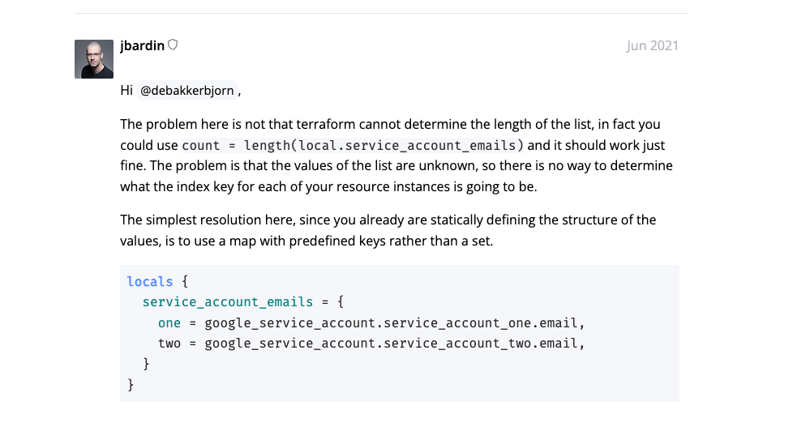

通过Terraform创建云主机时，在某些业务场景下，一个机器需要挂载多个云盘，一般云厂商都是单独创建云主机和云硬盘然后通过attachment的资源去挂载，因此我们的模板大致如下：

```hcl
resource "tencentcloud_instance" "basic" {
  instance_name     = var.instance_name
  password = "xxx"
}

resource "tencentcloud_cbs_storage" "storage" {
  for_each          = var.data_disks
  storage_name      = each.key
  storage_type      = each.value.disk_type
  storage_size      = each.value.size
}

resource "tencentcloud_cbs_storage_attachment" "attachment" {
  count       = length(tencentcloud_cbs_storage.storage)
  storage_id  = element(values(tencentcloud_cbs_storage.storage)[*].id, count.index)
  instance_id = tencentcloud_instance.basic.id
}


variable "data_disks" {
  type = map(object({
    disk_type = string
    size      = number
  }))
  description = "Instance Data Disks"
  default     = {}
}
```

这个模板我们一直用了很久，完全满足多盘的需求，也具有一定灵活性，但是随着全方位降本的需求，在服务优化等措施下，业务方评估可以考虑减少云盘数量，因为机型的特殊性，机器也不能回收重新创建。

因为之前一直没有减盘的场景，所以一直没关注，直到最近业务方评估需要减盘，发现在减盘时盘的attachment会销毁重新创建，腾讯云这个资源的操作会伴随unmount动作，导致减盘之后盘没有被挂载上

这个现象是不在我的预期当中的，分析Terraform的日志：

```text
  # tencentcloud_cbs_storage_attachment.attachment[0] must be replaced
-/+ resource "tencentcloud_cbs_storage_attachment" "attachment" {
      ~ id          = "disk-mcklmp5z" -> (known after apply)
      ~ storage_id  = "disk-mcklmp5z" -> "disk-rspjpenh" # forces replacement
        # (1 unchanged attribute hidden)
    }

  # tencentcloud_cbs_storage_attachment.attachment[1] must be replaced
-/+ resource "tencentcloud_cbs_storage_attachment" "attachment" {
      ~ id          = "disk-rspjpenh" -> (known after apply)
      ~ storage_id  = "disk-rspjpenh" -> "disk-k9c5lg1v" # forces replacement
        # (1 unchanged attribute hidden)
    }

  # tencentcloud_cbs_storage_attachment.attachment[2] must be replaced
-/+ resource "tencentcloud_cbs_storage_attachment" "attachment" {
      ~ id          = "disk-k9c5lg1v" -> (known after apply)
      ~ storage_id  = "disk-k9c5lg1v" -> "disk-jl5g1u7f" # forces replacement
        # (1 unchanged attribute hidden)
    }

  # tencentcloud_cbs_storage_attachment.attachment[3] must be replaced
-/+ resource "tencentcloud_cbs_storage_attachment" "attachment" {
      ~ id          = "disk-jl5g1u7f" -> (known after apply)
      ~ storage_id  = "disk-jl5g1u7f" -> "disk-mytvnnif" # forces replacement
        # (1 unchanged attribute hidden)
    }
```

发现attachment的索引是index，减盘的时候索引会重新计算，这就是attachment资源被销毁重建，导致云盘被卸载的原因。

原因明确了，那就好解决了，可以用for_each来解决这个问题，如下：
```hcl
resource "tencentcloud_cbs_storage_attachment" "attachment" {
  for_each = toset(values(tencentcloud_cbs_storage.storage)[*].id)
  storage_id  = each.key
  instance_id = tencentcloud_instance.foo.id
}
```

事情往往没那么顺利：

```text
│ Error: Invalid for_each argument
│
│   on main.tf line 61, in resource "tencentcloud_cbs_storage_attachment" "attachment":
│   61:   for_each = toset(values(tencentcloud_cbs_storage.storage)[*].id)
│     ├────────────────
│     │ tencentcloud_cbs_storage.storage is object with 6 attributes
│
│ The "for_each" value depends on resource attributes that cannot be
│ determined until apply, so Terraform cannot predict how many instances will
│ be created. To work around this, use the -target argument to first apply
│ only the resources that the for_each depends on.
```

好吧，在Terraform论坛发现一个issue：
https://discuss.hashicorp.com/t/the-for-each-value-depends-on-resource-attributes-that-cannot-be-determined-until-apply/25016


简而言之，就是foreach要求他的map key必须是已知明确的值，不能是依赖其他资源的值，所以会有如上错误。知道限制了调整下模板：
```hcl
resource "tencentcloud_cbs_storage_attachment" "attachment" {
  for_each = var.data_disks
  storage_id  = tencentcloud_cbs_storage.storage[each.key].id
  instance_id = tencentcloud_instance.basic.id
}
```

圆满解决，新创建的实例用上新的模板，但是存量的实例无法调整还是得忍受下盘重新挂载的问题。
