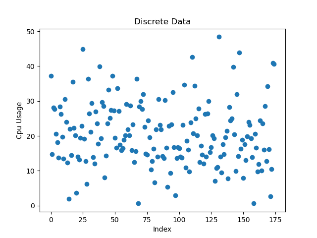
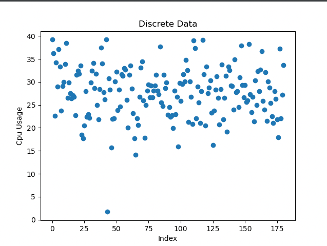

## 背景
kubernetes 的原生调度器只能通过资源请求来调度 pod，这很容易造成一系列负载不均的问题，
并且很多情况下业务方都是超额申请资源，因此在原生调度器时代我们针对业务的特性以及评估等级来设置 Requests/Limit 比例来提升资源利用效率。
在这种场景下依然存在很多问题：
1. 节点负载不均：原生 Kubernetes Scheduler 根据 Requests 和节点可分配总量来调度 Pod，既不考虑实时负载，也不估计使用量，这种纯静态的调度导致节点资源利用率分配不均。
   在流量波动性业务的场景下，在流量高峰时，部分节点利用率突破安全阈值，但是很多节点的利用率特别点，节点利用率相差特别大
2. 业务周期性：在离线集群分离，在线集群底峰存在巨大资源浪费

<!--more-->
本文主要讨论如果解决问题一，在线集群内部提升资源利用率

在线集群 Cpu 离散系数0.45，整个集群高峰时 Cpu 利用率仅25%左右；下图 Cpu 使用率离散图：

## 破局

基于上述情况，高峰时 Cpu 利用率仅25%肯定不是合理的情况，业界做的好的50%+。想要继续提升利用率，必须解决节点负载不均问题：
    
1. 感知节点真实负载：要解决节点负载不均问题，必须要上报节点当前真实的负载
2. 基于负载的正向调度插件：在默认调度器的基础上增加基于负载的调度插件，在正向调度是尽量保证节点间水位平均
3. 基于负载的重调度组件：当业务不断波动，节点可能会因为应用负载变化导致节点负载出现差别，需要重调度迁移 Pod 重新达到平均

## 实践

关注的两个开源项目：

Koordinator: https://koordinator.sh/

Crane: https://gocrane.io/

相对于 Koordinator 专门为混部而生的软件，Crane以 Finops 为出发点，二者相比Koordinator更适合我们，在离线混部也是下一步计划。

[调研测试](https://leason.top/Koordinator%E6%B7%B7%E9%83%A8%E7%B3%BB%E7%BB%9F.html)

上线之后：

### 遇到的问题
1. 热点节点问题：在业务高峰时，节点负载变高，会出现热点节点，这个时候需要重调度组件介入，把 Pod 重新调度到其他节点上
   
需要前置打散热点节点，这就需要对应用进行资源画像，在调度中分散这种类型的应用，避免业务高峰热点节点的产生
2. 在1中的情况下，扩容部分节点缓解集群压力时，新上的节点会迅速被热点Pod占满，导致节点负载升高，再次触发重调度
   
调整调度插件中负载均衡打分插件的权重，让节点负载更均衡，避免热点节点问题
3. 找到合适的节点规格，小规格节点，更容器出现热点节点
   
在我们的业务场景下下，当前来看48c节点热点节点出现几率小于32c
