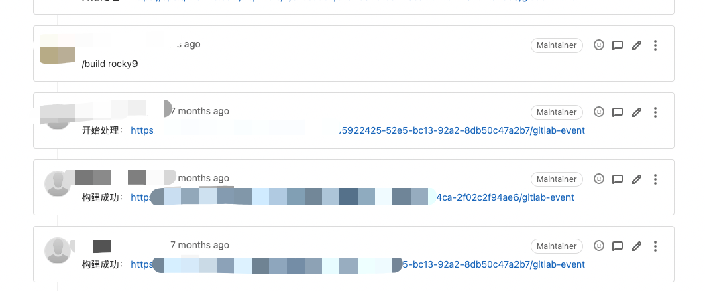
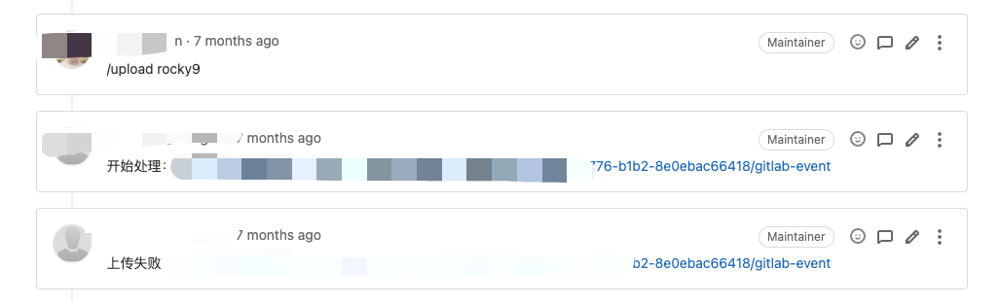

## 什么是Packer
[Packer](https://www.packer.io/) 是一个强大的工具，它可以帮助我们轻松地构建各种类型的镜像，如虚拟机镜像、Docker 镜像等。

Packer 的工作原理是通过定义一个配置文件，该文件描述了要构建的镜像的特征和要求。然后 Packer 使用这个配置文件来执行一系列的步骤，例如安装必要的软件、配置系统设置、复制文件等，最终生成一个可用的镜像。

<!--more-->
### 为什么要用 Packer

使用 Packer 构建镜像的好处是多方面的。
1. 可移植性：首先，它提供了一种可重复的、自动化的方式来创建镜像，这意味着我们可以确保每次构建的镜像都是一致的，从而减少了人为错误的风险。其次，Packer 支持多种基础设施提供商，如 AWS、VMware、Azure 等，这使得我们可以在不同的环境中轻松地部署镜像。
2. 自动化：Packer 依据单个的配置文件, 能做到流水线式 + 并发的创建镜像，与传统手工操作相比，其 "Infrastructure as Code" 的工作方式也大大减少了失误的概率。
3. 问题的追溯与定位：在 Packer 上所有变化都是基于代码的，而代码是可以追溯的，方便快速定位问题并回滚。而在传统方式中，考虑到手动操作的过程可能涉及多人，完整地追出问题并不是一件容易的事儿。
4. 快速迭代：Packer 的配置文件是可编辑的，因此我们可以轻松地修改配置文件，然后重新构建镜像，从而快速迭代。


### Packer的组成及及原理
Packer包含构建器(Builder),（派生器）Provisioner,(后处理器)Post-Processor三个组件，通过JSON格式的模板文件，可以灵活的组合这三种组件并行的、自动化的创建多平台一致的镜像文件。为单个平台生成镜像的单个任务称为构建，而单个构建的结果也称为工件(Artifact)，多个构建可以并行运行。

- Builder又称构建器，能够为单个平台创建镜像。构建器读取一些配置并使用它来运行和生成镜像。作为构建的一部分调用构建器以创建实际生成的镜像。常见的构建器包括VirtualBox，Alicloud ECS和Amazon EC2。构建器可以以插件的形式创建并添加到Packer中。
- Provisioner(派生器），这一组件在Buider创建的运行的机器中安装和配置软件。他们执行使镜像包含有用软件的主要工作。常见的派生器包括shell脚本，Chef，Puppet等。
- Post-Processors(后处理器），它使用构建器或另一个后处理器的结果来创建新工件的过程。例如压缩后处理器压缩工件，上传后处理器上传工件等。

## 落地

1. 通过qemu-kvm本地构建镜像
2. 通过gitlab仓库管理镜像构建的参数配置模板
3. 通过gitops触发构建，跟踪构建日志以及构建结果(提交模板变更merge request，通过评论触发构建任务)


| 工具                        | 版本 | 说明
| --------------------------------------- | ----------| ----------
| Packer | 1.9.4 | 官方文档
| Packer-plugin-qemu | 1.0.10 | Packer 插件
| qemu-kvm | 7.0.0 | QEMU 7.0.0

### 模板
```json
packer {
  required_plugins {
    qemu = {
      source  = "github.com/hashicorp/qemu"
      version = ">= 1.0.10"
    }
  }
}

variable "checksum" {
  type    = string
  default = "xxxxxxx"
}

variable "ssh_password" {
  type    = string
  default = "xxxxx"
}

source "qemu" "autogenerated_1" {
  accelerator          = "kvm"
  boot_command         = ["<tab> inst.text ", "console=ttyS0,115200n8 ", "inst.ks=http://{{ .HTTPIP }}:{{ .HTTPPort }}/ks/rocky9.ks ", "nameserver=1.1.1.1 ", "<enter><wait> "]
  boot_wait            = "0s"
  communicator         = "ssh"
  format               = "qcow2"
  headless             = true
  iso_checksum         = "sha256:${var.checksum}"
  iso_url              = "../../../Rocky-9.2-x86_64-minimal.iso"
  qemu_binary          = "/usr/libexec/qemu-kvm"
  qemuargs             = [["-m", "4096"], ["-smp", "2,sockets=2,cores=1,threads=1"], ["-cpu", "host"], ["-serial", "file:serial.out"]]
  shutdown_command     = "/sbin/halt -h -p"
  shutdown_timeout     = "120m"
  ssh_password         = "${var.ssh_password}"
  ssh_timeout          = "1500s"
  ssh_username         = "root"
  http_content = {
      "/ks/rocky9.ks"     = file("../../kickstart/rocky9.ks")
    }
}

build {
  description = "\tMinimal Rockylinux 9 Qemu Imageni\n__________________________________________"

  sources = ["source.qemu.autogenerated_1"]

  provisioner "shell" {
    script = "./provisioner.sh"
  }
  
#  provisioner "file" {   // 拷贝配置文件
#    destination = "/etc/cloud/cloud.cfg"
#    source      = "../../resource/cloud.cfg"
#  }

}
```

### 配置库组织形式

1. 配置仓库模板化了kickstart文件（这个部分往往是不经常变动的）
2. 对于不同镜像的模板文件放在不同的目录下，方便管理
3. 同一个镜像目录下三个文件 
   1. packer的hcl文件（packer模板主文件）
   2. provisioner.sh 制备过程中脚本，镜像中需要安装的包，修改的文件等等
   3. env.yaml 为了联动DevOps系统的一些配置，比如标识当前这个镜像的版本、类型、用途等等
4. resources 目录主要存放一些资源文件，如配置文件，脚本等等

```yaml

├── kickstart        # kickstart 配置文件存放目录
│   ├── rocky9.ks
├── packer           # 不同版本镜像模板文件
│   ├── rocky9
│   │   ├── rocky9.pkr.hcl
│   │   ├── provisioner.sh  # 制备过程中脚本，安装包，修改内核参数等等
│   │   ├── env.yaml   # 系统一些配置，如os_type，os_version
│   ├── centos7 
│   │   ├── centos7.pkr.hcl
│   │   ├── provisioner.sh
│   │   ├── env.yaml   # 系统一些配置，如os_type，os_version
├── resources        # 一些资源文件，配置文件可以直接cpoy过去
```

### 效果




### 好处

1. 提升构建镜像自动化程度，提升效率：以往运维同学手动到云上打镜像得到镜像ID然后配置到DevOps系统中
2. 镜像版本可以描述，版本可追溯，更透明：以往的镜像版本都是通过人工打的，过段时间没人知道当前运行的镜像里面做了哪些改动，装了哪些东西，具有什么特性
