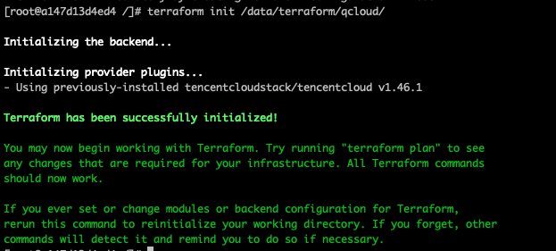
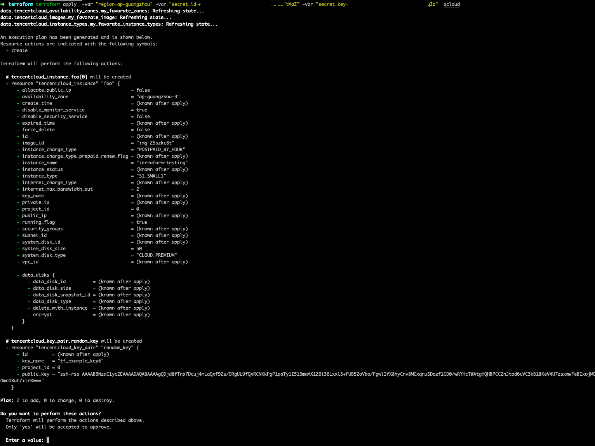

### Terraform介绍
Terraform是一种开源工具，用于安全高效地预配和管理云基础结，支持多家云服务提供商。以代码的形式将所要管理的资源定义在模板中，通过解析并执行模板来自动化完成所定义资源的创建，变更和管理，进而达到自动化运维的目标。
是基础设施即代码的一个实现。
<!--more-->
### 安装
Terraform版本：0.13.5
OS：Centos7 (on docker)

##### 下载安装包
`wget https://releases.hashicorp.com/terraform/0.13.5/terraform_0.13.5_linux_amd64.zip`
##### 解压安装包
`unzip terraform_0.13.5_linux_amd64.zip`
`mv terraform /usr/local/bin/`
`/usr/local/bin/terraform -v`

如果看到下面这个输出，则安装成功，非常简单方便
```
[root@a147d13d4ed4 /]# terraform version
Terraform v0.13.5
```

### 安装云厂商Provider
这里以腾讯云为例
通过terraform init 来自动下载provider，也可以在github上找到第三方provider编译自行安装详情见：

默认Plugins的安装位置在~/.terraform.d/plugins 下面，也可以通过指定-plugin-dir参数选择自定义plugins

terraform init -plugin-dir /data/terraform/plugins  /data/terraform/cloud/

/data/terraform/cloud/ 此目录下需要放置声明provider的tf文件

```
terraform {
  required_providers {
    tencentcloud = {
      source = "tencentcloudstack/tencentcloud"
      version = "1.46.1"
    }
  }
  required_version = ">= 0.13"
}

provider "tencentcloud" {
  region = var.region
  secret_id = var.secret_id
  secret_key = var.secret_key
}
```



上面的安装输出能看到有两个动作
`Initializing the backend...`

`Initializing provider plugins...`

由于没指定backend，所以这个backend是默认的tf.state文件，当然还有很多其他类型的

后面一个就是安装tf文件里声明的provider

### 资源变更
`terraform apply`
声明一个资源文件
```
data "tencentcloud_images" "my_favorate_image" {
  image_type = ["PUBLIC_IMAGE"]
  os_name    = "centos"
}

data "tencentcloud_instance_types" "my_favorate_instance_types" {
  filter {
    name   = "instance-family"
    values = ["S1"]
  }

  cpu_core_count = 1
  memory_size    = 1
}

data "tencentcloud_availability_zones" "my_favorate_zones" {}

resource "tencentcloud_key_pair" "random_key" {
  key_name   = "tf_example_key6"
  public_key = "ssh-rsa AAAAB3NzaC1yc2EAAAADAQABAAAAgQDjd8fTnp7Dcuj4mLaQxf9Zxxxxxxxxxxxxx"
}

resource "tencentcloud_instance" "foo" {
  instance_name     = var.instance_name
  availability_zone = data.tencentcloud_availability_zones.my_favorate_zones.zones.0.name
  image_id          = data.tencentcloud_images.my_favorate_image.images.0.image_id
  instance_type     = data.tencentcloud_instance_types.my_favorate_instance_types.instance_types.0.instance_type
  key_name          = tencentcloud_key_pair.random_key.id
  system_disk_type  = "CLOUD_PREMIUM"

  disable_monitor_service    = true
  internet_max_bandwidth_out = 2
  count                      = 1
}
```


创建一个云主机附带云盘
apply命令是应用所有资源的变化

该输出显示执行计划，描述terraform将根据配置文件执行那些动作来改变基础设施。输出格式与工具输出的diff产生的格式类似，比如git。输出内容在%20aws_instance.example%20有个%20+%20意味着Terraform将会创建该资源。在那些之下，显示将会被设置的属性。当值为<computed>时，意味着资源被创建后才能知道。

创建完之后使用`terraform show`检查当前状态：

如果我只想改变某个实例的状态怎么办？

使用参数 `-target=tencentcloud_instance.foo`

同理销毁
`terraform terraform destroy -target=tencentcloud_instance.foo  -var "region=ap-guangzhou" qcloud/`

### 已有资源导入
已有资源导入或者和声明的tf文件绑定关系

terraform本身是有状态的，比如tf.state文件
该状态文件极其重要；它追踪创建的资源ID，所以Terraform知道它管理的是什么资源。该文件必须被保存并分发给可能使用terraform的任何人。通常建议在使用Terraform时设置[远程状态](https://www.terraform.io/docs/state/remote.html)，来自动分享状态.

导入就是让terraform拥有这些资源的状态进而进行管理
```
terraform terraform import -config=ucloud/ ucloud_instance.outstanding3 uhost-1oevmy35
```


[以上内容皆来自官方文档](https://www.terraform.io/intro/getting-started/build.html)
