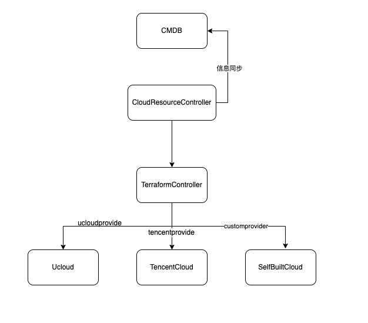

### 背景
现在越来越多的企业会选择将自己的业务上云，一方面是因为云厂商越来越稳定完善，上云可以获得更稳定省心的IaaS层，另一方面是相比较于自建，可以节省成本。如果企业追求更极致的SLA，往往会更近一步，选择多云，毕竟鸡蛋放两个篮子里可以更安全些。

好处当然是显然易见，但是问题也随之而来

### 多云带来的问题
多云会带来很多问题，比如多云之间的网络专线费用，多云之间的流量隔离（故障容灾），以及他们之前不通的技术栈所带来的运维层面的屏蔽。我们这里着重谈论多云带来的云资源交付的问题：
1. 资源交付自动化的过程中需要对接多云的文档或者SDK，体力活，并且会有持续的增量开发
2. 产品层面建模屏蔽云厂商的差异，用户不需要感知云厂商，也不应该感知云厂商的存在，因为IaaS层应该可以随时从一个云迁移到另外一个云，只有具备这种能力，才具备与云厂商的议价权（企业用户折扣真的可以很大）
3. 每个云上都有产品，难道我们真的要每个产品都对应去建模，如果不建模该怎么办
4. 容器化大潮，如何相对统一的交付资源

<!--more-->
### 方案设计

#### TerraformController
使用 Terraform 去解决对接多云的麻烦，并且 Terraform 还具有让不同云厂商的资源描述输入和输出相对统一，但是Terraform本身是个Cli工具，所有可以用一个
开箱即用的开源程序[TerraformController](https://github.com/kubevela/terraform-controller)去让它完美的云原生化

#### 自定义云资源 K8s CRD
使用 K8s CRD 去定义自己的云资源，一套控制程序交付所有云资源

#### 资源类型
定义不同的云资源类型来应对不同的云厂商的不同的云资源

