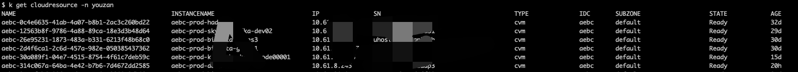

### 背景
现在越来越多的企业会选择将自己的业务上云，一方面是因为云厂商越来越稳定完善，上云可以获得更稳定省心的IaaS层，另一方面是相比较于自建，可以节省成本。如果企业追求更极致的SLA，往往会更近一步，选择多云，毕竟鸡蛋放两个篮子里可以更安全些。

好处当然是显然易见，但是问题也随之而来

### 多云带来的问题
多云会带来很多问题，比如多云之间的网络专线费用，多云之间的流量隔离（故障容灾），以及他们之前不通的技术栈所带来的运维层面的屏蔽。我们这里着重谈论多云带来的云资源交付的问题：
1. 资源交付自动化的过程中需要对接多云的文档或者SDK，体力活，并且会有持续的增量开发
2. 产品层面建模屏蔽云厂商的差异，用户不需要感知云厂商，也不应该感知云厂商的存在，因为IaaS层应该可以随时从一个云迁移到另外一个云，只有具备这种能力，才具备与云厂商的议价权（企业用户折扣真的可以很大）
3. 每个云上都有产品，难道我们真的要每个产品都对应去建模，如果不建模该怎么办
4. 容器化大潮，如何相对统一的交付资源

<!--more-->
### 方案设计


通过抽象定义云资源模型，定义云资源模板，由自定义云资源CRD operator 将InstanceType中的tf模板填充，最终通过Terraform交付云资源。
在这个过程中，自定义云资源CRD operator需要做一定的概念转化工作，即把自己定义通用的模型转化为不同云厂商的模型， 因为tf模板定义了相同的输入输出，
所以自定义云资源CRD operator的代码是通用的，不需要对每个云做适配，只需要对自己的通用模型做一次适配就好（通用模型填充TF模板）。

#### TerraformController
使用 Terraform 去解决对接多云的麻烦，并且 Terraform 还具有让不同云厂商的资源描述输入和输出相对统一，但是Terraform本身是个Cli工具，所有可以用一个
开箱即用的开源程序[TerraformController](https://github.com/kubevela/terraform-controller)去让它完美的云原生化

该开源软件主要优势：
1. 具有 Terraform 完全能力，多云拓展方便
2. Terraform 资源使用 kubernetes 接管，不需要再去关心Terraform的部署存储
3. 统一资源为 configuration CRD


#### 自定义云资源 K8s CRD
使用 K8s CRD 去定义自己的云资源，一套控制程序交付所有云资源

例子：
```yaml
apiVersion: paas.youzan.com/v1
kind: CloudResource
metadata:
  labels:
    env: qa
    idc: qabb
    instance_name: qabb-qa-test1
    type: cvm
  name: qabb-4a1fe56c-1a56-42f9-97ff-2ca779395861
  namespace: prod
spec:
  components:
  - idc: qabb
    instance_name: qabb-qa-test1
    instance_spec: 1c4g
    instance_type: 9b977623-d9e1-4a74-a667-2c68121593f1
    name: cvm
    properties:
      data_disks:
        data_disk_287765:
          disk_type: LOCAL_SSD
          size: 100
      image_id: uimage-zxr3dye4
      os_type: centos7
      sys_disk_size: 20
      sys_disk_type: LOCAL_SSD
    sub_zone: default
    type: cvm
```

1. idc： 机房，按照业务划分的逻辑机房，很多配置都会绑定此概念，比如vpc网段，机型，镜像等等
2. instance_name： 实例名称
3. instance_type： 实例类型，映射到云厂商的资源类型，后面又详细介绍
4. instance_spec： 实例规格，映射到云厂商的实例的规格，后面又详细介绍
5. name：组件名称
6. sub_zone：子域，网络层面机房内划分的区域，可以对应一段子网
7. type：组件类型
8. properties： 一些非结构化动态参数

以上就是通用云资源模型的定义，基本可以满足常用云资源的定义。

#### 资源类型
定义不同的云资源类型来应对不同的云厂商的不同的云资源

```yaml
apiVersion: paas.youzan.com/v1
kind: InstanceType
metadata:
  labels:
    cloud: ucloud
    disabled: "false"
    type: cvm
  name: 9b3677c8-186e-4812-9d83-040145dc9622
  namespace: prod
spec:
  definition: 9b3677c8-186e-4812-9d83-040145dc9622
  idc:
  - idc1  # 运行使用此机型的机房
  - idc2
  instance_spec:
  - cpu_num: "1"
    mem_size: "1"
    name: 1c1g
    spec: n-highcpu-1  # 一般对应值不用云厂商的规格描述，这也是一种屏蔽多云差异的手段
  type: cvm
```

云资源模板
大多数情况下一种云的一种资源（比如云主机）定义一种模板就行了，但是由于一种云的一种资源可能有很多种机型，比如ucloud有N、O、OS等，所以抽象InstanceTypeDefinition复用

```yaml
apiVersion: paas.youzan.com/v1
kind: InstanceTypeDefinition
metadata:
  labels:
    cloud: ucloud
    disabled: "false"
    type: cvm
  name: 9b3677c8-186e-4812-9d83-040145dc9622
  namespace: prod
spec:
  definition: |-
    terraform {
      required_providers {
        ucloud = {
          source = "ucloud/ucloud"
        }
      }
    }
    provider "ucloud" {
      base_url = "http://api.service.ucloud.cn"
    }
    resource "ucloud_instance" "basic" {
      availability_zone = var.zone
      image_id          = var.image_id
      instance_type     = var.spec
      root_password     = "Sfhrldxqt&ggy"
      name              = var.instance_name
      charge_type = "month"
      boot_disk_type    = var.sys_disk_type
      boot_disk_size    = var.sys_disk_size
      min_cpu_platform = "Intel/Skylake"
      vpc_id = var.vpc_id
      subnet_id = var.subnet_id
      security_group = length(var.security_groups) > 0 ? var.security_groups[0] : null
      allow_stopping_for_update = true
      delete_disks_with_instance = true
      delete_eips_with_instance = true
    }
    resource "ucloud_disk" "storage" {
      for_each          = var.data_disks
      availability_zone = var.zone
      name              = each.key
      disk_size         = each.value.size
      disk_type          = each.value.disk_type
      rdma_cluster_id = each.value.disk_type == "rssd_data_disk" ? ucloud_instance.basic.rdma_cluster_id : null
    }
    resource "ucloud_disk_attachment" "default" {
      count       = length(ucloud_disk.storage)
      availability_zone = var.zone
      disk_id  = element(values(ucloud_disk.storage)[*].id, count.index)
      instance_id = ucloud_instance.basic.id
    }
    variable "zone" {
      default     = "ap-beijing-7"
      description = "Availability Zone"
      type        = string
    }
    variable "instance_name" {
      default     = "test_instance_name"
      description = "Instance Name"
      type        = string
    }
    variable "image_id" {
      description = "Instance Image Id"
      type        = string
    }
    variable "project_id" {
      description = "project Id"
      type        = string
    }
    variable "spec" {
      description = "Instance spec"
      type        = string
    }
    variable "vpc_id" {
      description = "Vpc Id"
      type        = string
    }
    variable "subnet_id" {
      description = "Instance Subnet Id"
      type        = string
    }
    variable "security_groups" {
      type        = list(string)
      description = "Instance Security Groups"
      default     = []
    }
    variable "sys_disk_type" {
      default     = "CLOUD_PREMIUM"
      description = "sys disk type"
      type        = string
    }
    variable "sys_disk_size" {
      default     = 20
      description = "sys disk size"
      type        = number
    }
    variable "data_disks" {
      type = map(object({
        disk_type = string
        size      = number
      }))
      description = "Instance Data Disks"
      default     = {}
    }
    output "instance_id" {
      description = "Instance ID"
      value       = ucloud_instance.basic.id
    }
    output "instance_ip" {
      description = "Instance Ip"
      value       = ucloud_instance.basic.private_ip
    }
    output "status" {
      description = "Instance Status"
      value       = ucloud_instance.basic.status
    }
    output "system_disk_id" {
      description = "Instance sys disk id"
      value       =  [for d in ucloud_instance.basic.disk_set : d.id if d.is_boot == true][0]
    }
    output "system_disk_size" {
      description = "Instance sys disk size"
      value       =  [for d in ucloud_instance.basic.disk_set : d.size if d.is_boot == true][0]
    }
    output "system_disk_type" {
      description = "Instance sys disk type"
      value       =  [for d in ucloud_instance.basic.disk_set : d.type if d.is_boot == true][0]
    }
    output "data_disks" {
      description = "Instance Data Disks"
      value       = [for key, value in ucloud_disk.storage : { "${key}": {"sn": value.id, "disk_type": value.disk_type, "size": value.disk_size} }]
    }
```

效果



1. 对资源的控制非常简单，操作CR记录就可以达到效果，像机器的创建、销毁、扩容简直不要太简单，并且不用关心底层是什么云
2. 新资源的接入变成写写一份TF模板，除非非常不典型的资源需要少量开发
3. 接入新的云厂商也是手到擒来，毕竟在TerraformController里大的云厂商都对接好了，只需要编写新的TF模板和把对应云厂商的Provider打到Terraform镜像就行了[docker-terraform](https://github.com/oam-dev/docker-terraform)